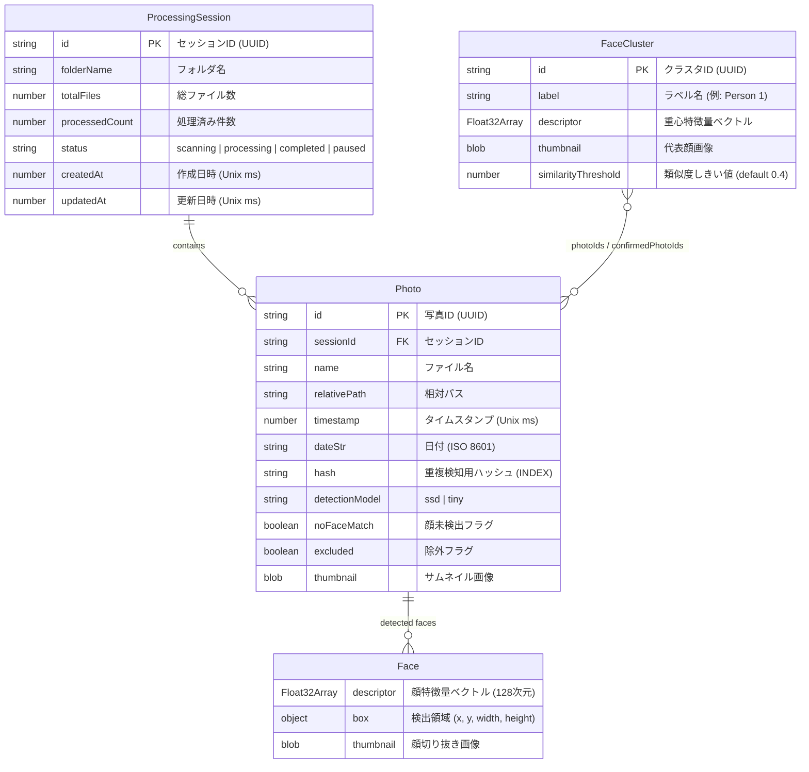

# ER図

IndexedDB (`photo-selector-db`) のエンティティ関連図。

## エンティティ説明

| エンティティ          | ObjectStore 名             | Key  | インデックス                            | 説明                     |
| :-------------------- | :------------------------- | :--- | :-------------------------------------- | :----------------------- |
| **ProcessingSession** | `sessions`                 | `id` | —                                       | 写真取り込みセッション   |
| **Photo**             | `photos`                   | `id` | `by-session`, `by-timestamp`, `by-hash` | 写真メタデータ＋検出結果 |
| **Face**              | — (Photo 内の埋め込み配列) | —    | —                                       | 検出された個別の顔情報   |
| **FaceCluster**       | `clusters`                 | `id` | —                                       | 顔クラスタリング結果     |

## リレーション説明

| 関連                      | カーディナリティ | 説明                                                                       |
| :------------------------ | :--------------- | :------------------------------------------------------------------------- |
| ProcessingSession → Photo | 1 : N            | 1つのセッションに複数の写真が属する (`Photo.sessionId` で参照)             |
| Photo → Face              | 1 : N            | 1つの写真から複数の顔が検出される (`Photo.faces[]` に埋め込み)             |
| FaceCluster ↔ Photo       | N : M            | `FaceCluster.photoIds[]` および `confirmedPhotoIds[]` で多対多の関連を保持 |
